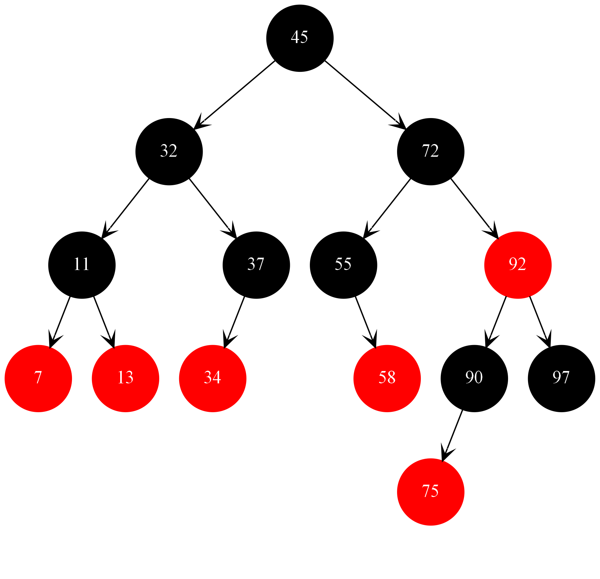

# C-

## 红黑树实现与可视化 C++

## 随机生成1000颗红黑树，节点数量100~10000，随机删除树中的节点并验证是否符合红黑树的五条性质

## 可视化通过graphviz，需要先安装软件

`dot -Tpng rbtree -o rbtree.png`

* visual studio 2019 测试通过
* Ubuntu 18.04 测试通过

> 实现参考了《算法导论》
> 可视化参考了[南浦月](https://blog.nanpuyue.com/2019/054.html)
